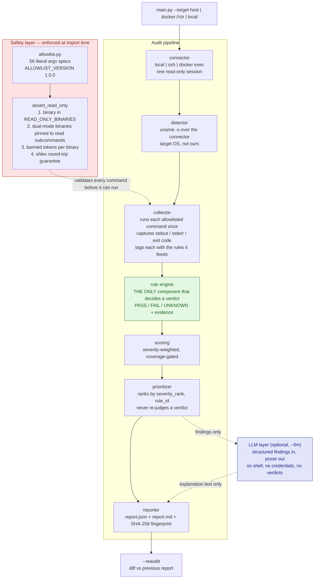
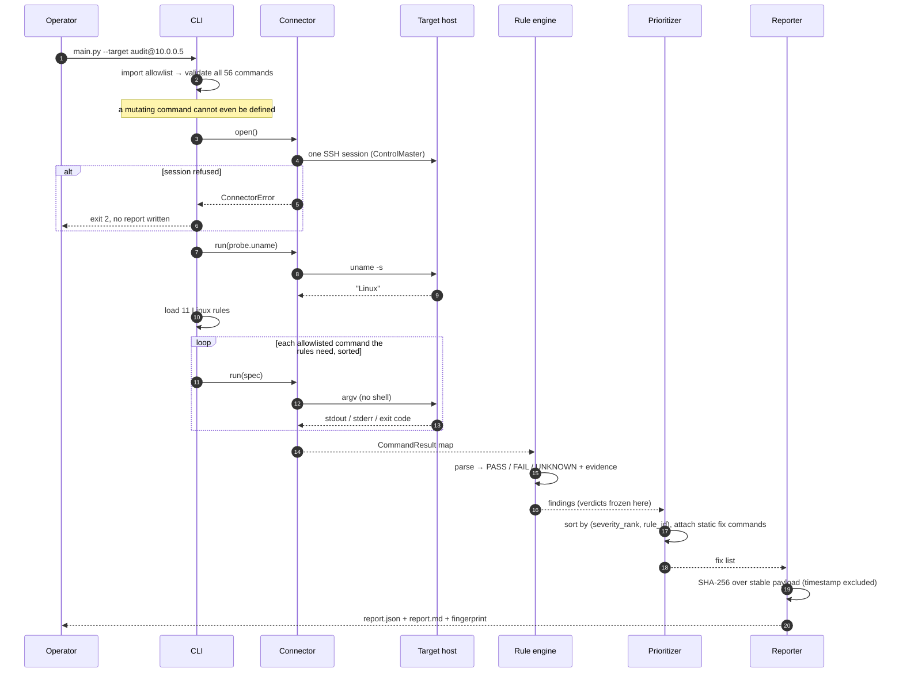
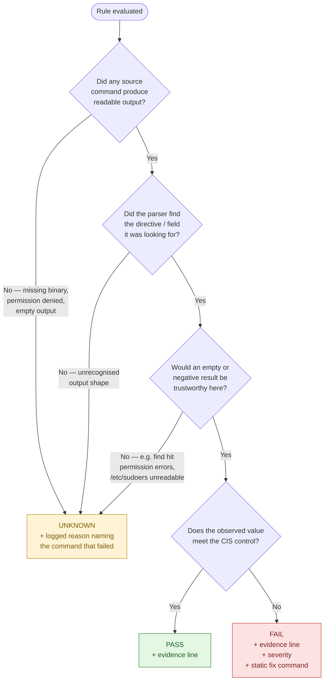
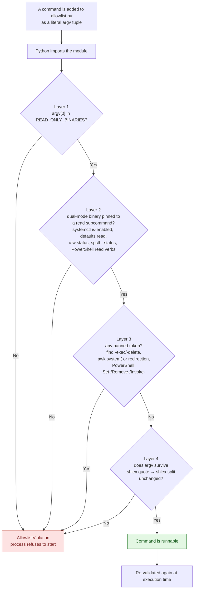
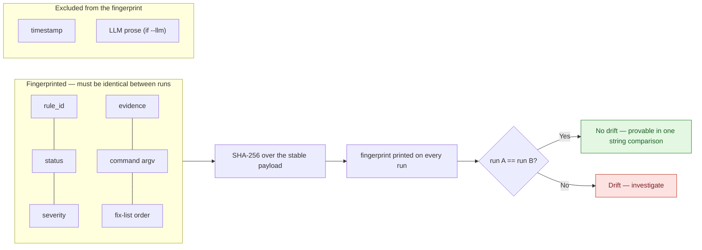
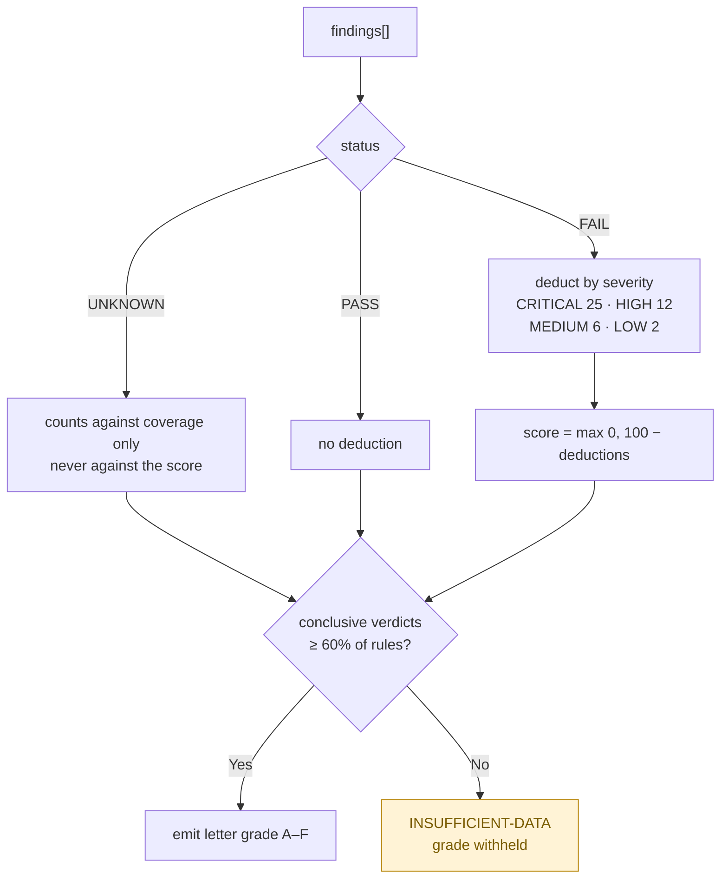
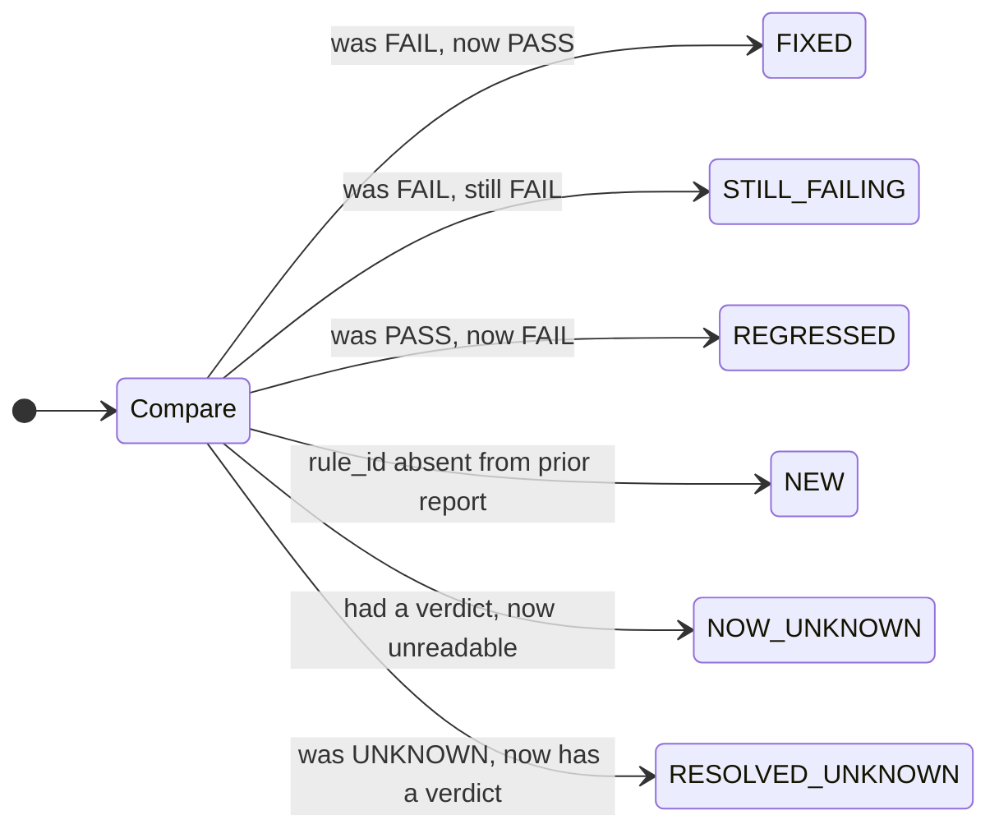

# SentinelAudit — Final Project Report

**Event:** IT HAPPENS @ RAALE #5 — *CIS Audit Agent*
**Problem statement:** Build an agent that audits hosts against CIS-Benchmark-style
rules and turns raw read-only command output into a prioritized, copy-paste-ready
remediation plan.
**Repository:** `prithivirj4706/RISE-RST`
**Pipeline:** `COMMANDS → RULES → PRIORITIZER → FIX LIST`

---

## At a glance

| | |
| --- | --- |
| **Transports** | `local`, `ssh` (OpenSSH ControlMaster), `docker exec` — one shared `Connector` interface |
| **Allowlist** | 56 commands, version `1.0.0`, validated **at import time** — 22 Linux / 21 macOS / 11 Windows / 2 probe |
| **Rules** | 34 total — 11 Linux, 14 macOS, 9 Windows |
| **Verdicts** | `PASS` / `FAIL` / `UNKNOWN`, decided **only** by deterministic parsers |
| **Determinism** | SHA-256 fingerprint over the stable payload; 3 consecutive runs → identical fingerprint |
| **Prioritizer** | Deterministic ordering `(severity_rank, rule_id)`; LLM optional, prose only |
| **Remediation** | Static known-good command table — never LLM-authored |
| **Dependencies** | None for the core audit (Python 3.10+); `pytest` for the test suite |
| **Tests** | 128 passing |
| **Exit codes** | `0` ok · `1` internal · `2` connector · `3` detection · `4` usage |

---

## 1. What we built

SentinelAudit is a read-only security auditing agent that opens **one** session to a
target — over SSH, `docker exec`, or locally — runs a fixed allowlist of strictly
read-only commands, evaluates CIS-Benchmark-style rules with small deterministic
parsers, and emits `report.json` plus `report.md` containing a severity-ranked
remediation plan. Every fix-list item carries its rule ID, the exact command that was
run, the raw output excerpt that produced the verdict, and a vetted remediation
command, so a reader can check any item against its evidence instead of trusting the
tool. A rule whose evidence cannot be read produces `UNKNOWN` with a logged reason —
never a guessed PASS or FAIL. Each report carries a SHA-256 fingerprint computed over
everything except the timestamp, which turns *"did this run drift?"* into a string
comparison. A `--reaudit` mode diffs against the previous report and reports
`FIXED` / `STILL_FAILING` / `NEW` / `REGRESSED` along with the score delta.

**What works:** the entire path, end to end, on Linux (verified against real Docker
targets) and macOS (verified against real hosts, including an independent
re-verification recorded in §4.2). All three transports open real sessions. The
allowlist validator, the determinism guarantee, graceful degradation under missing
permissions, re-audit, and the optional LLM layer are all implemented and exercised.

**What does not:** the 9 Windows rules have **never been executed against a real
Windows host**. They are written against documented PowerShell `Format-List` output
shapes and are structured to return `UNKNOWN` rather than guess, but they are
unverified. See §6.1.

### 1.1 System architecture



### 1.2 Component responsibilities

| Component | Responsibility | Explicitly *not* allowed to |
| --- | --- | --- |
| `allowlist.py` | Hold every runnable command as a literal argv tuple; validate all of them at import | Accept a command built at runtime by a rule, a config file, a CLI flag, or an LLM |
| `connectors/` | Open exactly one read-only session; execute argv vectors | Write credentials to logs or reports |
| `platforms/detector.py` | Identify the target OS from `uname -s` run *over the connector* | Assume the auditor's own OS is the target's |
| `engine.py` | Run each needed command once; hand output to parsers | Decide a verdict itself |
| `rules/*.py` | Decide `PASS` / `FAIL` / `UNKNOWN` from captured output | Run a command |
| `scoring.py` | Severity-weighted score; withhold the grade below 60% coverage | Deduct points for `UNKNOWN` |
| `prioritizer.py` | Rank failures; attach the static remediation command | Change a status, severity, or evidence field |
| `llm.py` | Write human-readable prose for existing findings | See a shell, a credential, or a raw transcript; invent a rule ID |
| `reporter.py` | Emit JSON + Markdown + fingerprint | Include the timestamp in the fingerprint |

### 1.3 End-to-end run sequence



---

## 2. The rule set

### 2.1 How a verdict is decided

Every parser in the codebase follows the same decision shape. This is what keeps
`UNKNOWN` an honest answer instead of a failure mode:



The `TRUST` gate is the one most teams skip, and it is where both of our false PASSes
lived (§4.4).

### 2.2 Linux — 11 rules (verified against real targets)

| Rule ID | Sev | What is checked | Command(s) read | How the parser decides |
| --- | --- | --- | --- | --- |
| `CIS-5.2.10` | CRITICAL | SSH root login disabled | `sshd -T`, fallback `cat /etc/ssh/sshd_config` | PASS iff effective `permitrootlogin` is exactly `no`. Falls back to the **first** `PermitRootLogin` directive in the file — OpenSSH honours the first, not the last. UNKNOWN if neither source is readable. |
| `CIS-5.2.11` | HIGH | SSH password authentication disabled | same two | PASS iff `passwordauthentication no`. |
| `CIS-5.4.1` | MEDIUM | Minimum password length policy set | `cat /etc/security/pwquality.conf`, `cat /etc/login.defs` | Prefers pwquality `minlen`, else `PASS_MIN_LEN`. PASS iff ≥ 14. Commented lines skipped. UNKNOWN when neither directive exists — the effective policy then lives in PAM modules this audit does not read. |
| `CIS-6.1.10` | HIGH | No world-writable files in system paths | `find /etc /usr/bin /usr/sbin /usr/local/bin -xdev -type f -perm -0002 -print` | FAIL listing sorted paths if any. PASS on empty. **UNKNOWN if `find` hit permission errors** — an empty result would not be trustworthy. |
| `CIS-6.1.2` | MEDIUM | `/etc/passwd` ownership + mode | `stat -c '%n %a %U %G' /etc/passwd` | PASS iff mode ⊆ 0644 and owner `root:root`. |
| `CIS-6.1.3` | HIGH | `/etc/shadow` ownership + mode | `stat -c … /etc/shadow` | PASS iff mode ⊆ 0640, owner `root`, group `root`/`shadow`. |
| `CIS-3.5.1` | HIGH | Host firewall active | `ufw status verbose` → `firewall-cmd --state` → `nft list ruleset` → `iptables -S` | First readable backend wins. ufw: `Status: active`. firewalld: `running`. nft: any `chain`. iptables: default DROP/REJECT on INPUT, or any rules. UNKNOWN when all four are unreadable — they normally require root. |
| `CIS-1.9` | MEDIUM | Automatic security updates enabled | `cat /etc/apt/apt.conf.d/20auto-upgrades`, `systemctl is-enabled unattended-upgrades.service`, `… dnf-automatic.timer` | APT: `Unattended-Upgrade` ≠ `0`. Unit: `enabled`/`enabled-runtime`/`static`. UNKNOWN if no mechanism is observable. |
| `CIS-6.2.1` | CRITICAL | No accounts with empty passwords | `awk -F: '($2 == "") { print $1 }' /etc/shadow` | FAIL listing account names. PASS on empty output with exit 0. **UNKNOWN on permission denied** — this check needs elevated read access and the agent never escalates. |
| `CIS-5.3.4` | HIGH | No blanket NOPASSWD in sudoers | `cat /etc/sudoers`, `grep -r -h -E NOPASSWD /etc/sudoers.d` | FAIL on any uncommented NOPASSWD line. **UNKNOWN if `/etc/sudoers` itself is unreadable** — an empty drop-in directory alone cannot prove the policy is clean. |
| `CIS-3.2.1` | MEDIUM | No unexpected wildcard listener | `ss -tulnH`, fallback `netstat -tuln` | Parses host/port; flags wildcard binds (`0.0.0.0`, `*`, `[::]`) on ports outside {22, 80, 443}. Cleanly-empty output = PASS. Non-empty but zero parseable socket rows = **UNKNOWN**. |

### 2.3 macOS — 14 rules (verified against macOS 15.x)

| Rule ID | Sev | Control | Primary source |
| --- | --- | --- | --- |
| `CIS-Apple-2.5.2.1` | HIGH | Application Firewall enabled | `socketfilterfw --getglobalstate` |
| `CIS-Apple-2.5.2.2` | LOW | Firewall stealth mode enabled | `socketfilterfw --getstealthmode` |
| `CIS-Apple-2.5.2.3` | MEDIUM | No unexpected wildcard listener | `netstat -an -p tcp`, `LISTEN` rows only |
| `CIS-Apple-2.6.1.1` | HIGH | FileVault enabled | `fdesetup status` |
| `CIS-Apple-2.6.2` | HIGH | Gatekeeper enabled | `spctl --status` |
| `CIS-Apple-2.4.1` | MEDIUM | Remote Login (SSH) disabled | `systemsetup -getremotelogin` |
| `CIS-Apple-1.2` | MEDIUM | Automatic security updates | `CriticalUpdateInstall` + `AutomaticallyInstallMacOSUpdates` |
| `CIS-Apple-5.1.1` | — | System Integrity Protection | `csrutil status` |
| `CIS-Apple-5.1.2/3/4` | — | `/etc/passwd`, `/etc/sudoers` modes, world-writable files | `stat -f`, `find` |
| `CIS-Apple-5.4` | HIGH | No blanket NOPASSWD in sudoers | `cat /etc/sudoers`, `grep -r … /etc/sudoers.d` |
| `CIS-Apple-6.1.1` | — | Guest account disabled | `defaults read … GuestEnabled` |
| `CIS-Apple-6.1.3` | — | Automatic login disabled | `defaults read … autoLoginUser` |

**Three parsers were rewritten after observing real output rather than assuming it:**

* `defaults read /Library/Preferences/com.apple.alf globalstate` **no longer exists**
  on macOS 15 — `socketfilterfw --getglobalstate` became primary, with `alf` kept only
  as a fallback for older releases.
* macOS `netstat` separates host and port with a **dot** (`*.3306`), not a colon, and
  lists established connections alongside listeners — the parser keeps `LISTEN` rows only.
* `defaults read … autoLoginUser` **exits non-zero when the key is absent, and absence
  is the secure state** — that parser reads the raw result rather than treating a
  non-zero exit as unreadable.

### 2.4 Windows — 9 rules (**not verified against a real host**)

Firewall profiles, Defender real-time protection, SMBv1, RDP listener, RDP NLA,
password policy, automatic updates, Guest account, BitLocker. All are read-only
PowerShell cmdlets piped through `Format-List`, so parsing is `Key : Value`. Every
parser returns `UNKNOWN` on any output shape it does not recognise. See §6.1.

---

## 3. Methods and decisions

| Decision | Chosen | Rejected | Why |
| --- | --- | --- | --- |
| **Transport** | One `Connector` interface, three implementations: `local`, `ssh`, `docker exec` | SSH-only | The interface costs ~40 lines and makes the tool testable against disposable containers while still auditing real remote hosts. `docker exec` takes an argv vector directly, so there is no shell on the target at all. |
| **SSH session** | OpenSSH `ControlMaster` — one authentication, ~20 multiplexed commands, torn down on close | One `ssh` invocation per command | "One read-only session" should be literally true. Also ~20× fewer authentications. |
| **SSH client** | Shelled-out OpenSSH | `paramiko` | Zero dependencies; the tool runs on a bare Python 3.10+. Host-key verification, `BatchMode` and `IdentitiesOnly` come free and correct. |
| **Command representation** | argv lists, executed `shell=False` | Shell strings | No quoting bugs, no word splitting, no injection surface. SSH is the one place a string is unavoidable — so the validator asserts every argv survives `shlex.quote` → `shlex.split` unchanged. |
| **Read-only enforcement** | Three layers, validated **at import time** | Code review and convention | A mutating command cannot be *defined* — the module raises on import. Re-validated again at execution time. See §3.1. |
| **Prioritizer** | Deterministic by default; LLM optional and bounded to prose | LLM decides ranking or verdicts | Ordering is `(severity_rank, rule_id)` — structural, so it cannot drift. The LLM never sees a shell, a credential, or a raw transcript, and any rule ID it returns that this run did not produce is discarded. |
| **Remediation commands** | Static known-good table, always | LLM-authored fix commands | A wrong-but-confident `sudo` command is the most dangerous thing this tool could emit. The handout offers this cross-check as a stretch goal "for at least a subset of rules" — we applied it to 100% of rules. |
| **Score** | Deterministic weights; **refuses to grade below 60% coverage** | Always emit a letter grade | An early build reported *"100/100, grade A"* after failing to read 9 of 11 checks. That is precisely the confidently-wrong output this project exists to avoid, so low coverage now yields `INSUFFICIENT-DATA`. |
| **UNKNOWN scoring** | Costs zero points; surfaced as *coverage* instead | Penalise UNKNOWN | An audit that could not read something has not found a problem. Inventing a deduction would be an unevidenced claim. |

### 3.1 How read-only is actually enforced



**Verified by experiment** — every one of these was rejected when we tried to define it
(reproduced independently on 2026-08-14, see §4.2):

| Attempted command | Rejected because |
| --- | --- |
| `rm -rf /tmp/x` | `'rm' is not in READ_ONLY_BINARIES` |
| `find /etc -delete` | `banned token '-delete'` |
| `systemctl restart sshd` | `subcommand 'restart' not allowed for systemctl` |
| `awk 'BEGIN{system("id")}' /etc/passwd` | `awk program contains 'system('` |
| `ufw enable` | `subcommand 'enable' not allowed for ufw` |
| `defaults write com.x k 1` | `subcommand 'write' not allowed for defaults` |

### 3.2 Determinism — the no-drift guarantee

The handout's Part 5 is scored all-or-nothing, so we made drift *structurally
impossible* rather than merely unlikely:



Three ingredients make it hold:

1. **Collection order is sorted.** `engine.collect()` sorts command IDs before running
   them, so even a partial run degrades identically.
2. **Ordering is structural.** The fix list sorts by `(severity_rank, rule_id)` — no
   model, no clock, no dict iteration order.
3. **The LLM cannot reach any fingerprinted field.** It writes prose only.

### 3.3 On "temperature 0"

The handout suggests a low or zero LLM temperature for reproducibility. **Current
Claude models reject the `temperature` parameter outright (HTTP 400)**, so that lever
no longer exists. We got determinism structurally instead: the LLM touches no field
that affects ordering, verdicts, severities, or fix commands, so two runs order
identically whether or not it ran and whether or not it produced the same words. The
fingerprint proves it rather than asking a judge to trust it.

### 3.4 Scoring and the coverage gate



### 3.5 Re-audit state machine

`--reaudit` diffs the current findings against the previous report:



`NOW_UNKNOWN` matters: a rule that silently stops being readable would otherwise look
like an improvement.

### 3.6 Credential hygiene

No credential is ever in the repository. The SSH key arrives as a **path** from
`--key` or `SENTINEL_SSH_KEY`, and only the path is recorded in the report — key
material is never read by this tool. `ANTHROPIC_API_KEY` is read from the environment
only. Host-key verification is **on by default**; `--insecure-host-key` prints a
warning to stderr *and* records it in the report's notes, so a report produced under
weakened verification says so on its face.

---

## 4. Results

### 4.1 Audit runs recorded during the build

| # | Target | Transport / user | Result | Correct? |
| --- | --- | --- | --- | --- |
| 1 | macOS 15.6.1 (dev host) | local | 4 FAIL / 9 PASS / 1 UNKNOWN — 68/100 C | Yes. Firewall off, FileVault off, MySQL on `*.3306`/`*.33060`, stealth mode off — all four confirmed by hand. |
| 2 | `sentinel-vulnerable` (ubuntu:22.04) | docker, root | 7 FAIL / 2 PASS / 2 UNKNOWN — 0/100 F | Yes. Caught **all 7** baked-in misconfigurations: root login, empty-password account, password auth, NOPASSWD grant, world-writable file, shadow mode 644, `PASS_MIN_LEN 4`. |
| 3 | `sentinel-hardened` (ubuntu:22.04) | docker, root | 0 FAIL / 10 PASS / 1 UNKNOWN — 100/100 A | Yes. The single UNKNOWN is the firewall check — no ufw/iptables in the image, correctly not guessed. |
| 4 | `sentinel-vulnerable` after 3 fixes applied | docker, root, `--reaudit` | 3 FIXED, 4 STILL_FAILING, 0 → 32/100 | Yes. Exactly the three remediated controls flipped; nothing else moved. |
| 5 | `sentinel-vulnerable` as unprivileged `nobody` | docker, non-root | 3 FAIL / 4 PASS / 4 UNKNOWN — 57/100 D | Yes — and the most informative run. See §4.3. |
| 6 | `192.0.2.1:2222` (unreachable) | ssh | No report, **exit 2** | Yes. `ssh: connect to host … Connection refused`. Fails loudly (Req 9). |
| 7 | `docker://nope`, daemon down | docker | No report, **exit 2** | Yes. Names the daemon socket in the error. |
| 8 | macOS host, Linux rules forced (`--platform linux`) | local | 11 UNKNOWN, grade withheld | Yes — after two bug fixes. See §4.4. |

### 4.2 Independent re-verification — 2026-08-14

The following were re-run from a clean clone on a **different macOS machine** than the
one used during the build, to confirm the claims above reproduce rather than being
one-off observations. Docker was not installed on this machine, so runs 2–5 and 7
could not be reproduced here and remain as recorded in §4.1.

| # | Check | Command | Observed | Verdict |
| --- | --- | --- | --- | --- |
| V1 | Audit completes on a real host | `main.py --target local` | 3 FAIL / 10 PASS / 1 UNKNOWN — **80/100 grade B**; App Firewall off, wildcard listener, stealth mode off | Pass |
| V2 | **No drift** across repeated runs | same command ×3 | fingerprint `288d5355b3324a54619f66c4392e842662d7202cd2b735a6f836756e32cdde92` — **identical all three times** | Pass |
| V3 | Platform mismatch is not guessed at | `--target local --platform linux` | **11 UNKNOWN**, zero PASS, zero FAIL, grade withheld, each with a named reason | Pass |
| V4 | Connector failure is loud | `--target audit@127.0.0.1 --port 2222` | `connector error: … Connection refused` + *"The run produced no report"*, **exit 2** | Pass |
| V5 | Missing Docker daemon is loud | `--target docker://nope` | names the daemon socket path, **exit 2**, no report | Pass |
| V6 | Malformed target | `--target docker://`, `--target user@` | `usage error: …`, **exit 4** | Pass |
| V7 | Allowlist rejects mutation | 6 mutating specs (§3.1) | all 6 rejected with a specific reason | Pass |
| V8 | Test suite | `pytest tests/` | **128 passed** in 0.12s | Pass |
| V9 | Allowlist inventory | `python3 -c "… len(ALL_COMMANDS)"` | 56 commands, version `1.0.0` — 22 Linux / 21 macOS / 11 Windows / 2 probe | Pass |

V3 is the important one: pointing the Linux rule set at a macOS host produces **eleven
UNKNOWNs and no verdicts at all**. Before the fixes in §4.4, that same run produced two
fabricated PASSes.

### 4.3 Run 5 in detail — the degradation case

Under an unprivileged audit user the tool did the right thing on every axis:

* `CIS-6.2.1` (empty passwords) → **UNKNOWN**, `/etc/shadow` unreadable — not a
  fabricated PASS.
* `CIS-5.3.4` (sudoers) → **UNKNOWN**, `/etc/sudoers` unreadable.
* `CIS-5.2.10` → still **FAIL**, but the evidence source *automatically switched* from
  `sshd -T` (needs root) to `/etc/ssh/sshd_config`, and the report cites the file it
  actually read.
* `CIS-6.1.2` / `CIS-6.1.3` → **PASS**, because `stat` works without read permission on
  the file's contents.

### 4.4 Two false PASSes we found and fixed

Both were caught by run 8 — deliberately pointing the Linux rule set at a macOS host —
and both are exactly the failure mode the handout warns about in §6.3: *"a parser can
silently match the wrong line and report a PASS that isn't real."*

1. **`CIS-3.2.1`, listening services.** macOS `netstat -tuln` **exits 0** and prints the
   *UNIX-domain socket table* — a completely different table with no TCP endpoints. The
   parser found no wildcard binds and reported PASS. **Fixed:** output that produces
   zero parseable socket rows is now UNKNOWN; only a *cleanly empty* table counts as
   "nothing listening".
2. **`CIS-5.3.4`, sudoers.** With `/etc/sudoers` unreadable and `/etc/sudoers.d` empty,
   the parser reported PASS. But a blanket NOPASSWD grant normally lives in
   `/etc/sudoers` itself, so an empty drop-in directory proves nothing. **Fixed:**
   UNKNOWN. (The macOS parser already handled this; the Linux one did not.)

Both bugs were invisible on a correctly-matched platform and only appeared when we
deliberately fed the agent a mismatched target.

### 4.5 Known false positive (by design)

`CIS-5.2.10` reports **FAIL** for `PermitRootLogin prohibit-password`. CIS 5.2.10
requires exactly `no`, so this is defensible and the evidence line shows the real
value — but many deliberately hardened hosts use key-only root login, and those
operators will read this as a false positive. We chose strict CIS conformance over our
own judgement, and surfaced the observed value so a reader can override it knowingly.

### 4.6 Known false negative (by design)

macOS `NET-001` ignores wildcard binds on ports ≥ 49152 (the IANA ephemeral range).
Kernel-assigned source ports appear there and change on every reboot, so including them
would make evidence unstable without describing a durable exposure. **A genuinely
exposed service on a high port would be missed.**

---

## 5. How we worked

### 5.1 Build sequence (actual)

The pipe was built before the logic, as the handout advises: allowlist + validator →
connectors → a rule engine returning real verdicts → report. The first end-to-end run
produced a real, correct report against the local macOS host, and every subsequent
change improved something that already worked.

**Verified before assuming.** Before writing a single macOS parser we ran the candidate
commands by hand and read the output. That decision paid for itself three times over
(§2.3) — `alf globalstate` does not exist on macOS 15, macOS `netstat` uses
dot-separated ports, and `autoLoginUser` treats absence as the secure state. Guessing
any of those would have produced a plausible parser that silently reported a wrong
verdict.

### 5.2 Planned vs actual — Part 8 checkpoints

> ⚠️ **To be completed by the team before submission.** The planned column is the
> handout's schedule; the actual column and the owner column are your record of the
> night and cannot be reconstructed from the repository. Part 11 awards 4 marks for
> *process and honesty* — an accurate account here, including checkpoints you missed,
> scores better than a tidy fiction.

| Time | Phase | Done when | Actual | Owner |
| --- | --- | --- | --- | --- |
| 0:00–0:10 | Read, agree architecture, split work | Everyone knows what they own | _____ | _____ |
| 0:10–0:35 | Skeleton — connector + collector + dummy finding | A real target returns one real fix-list item | _____ | _____ |
| 0:35–1:05 | Real collector — all allowlisted commands captured | Debug dump shows correct raw output | _____ | _____ |
| 1:05–1:45 | Real rule engine — ~10 deterministic parsers | Findings array has real evidenced verdicts | _____ | _____ |
| 1:45–2:15 | Real prioritizer — ranked fix list, no-drift check | Two runs produce identical ordering | _____ | _____ |
| 2:15–2:35 | Hardening — hostile input, credentials, allowlist review | Part 10 checklist passes | _____ | _____ |
| 2:35–2:40 | **BUILD FREEZE** — commit and push | Nothing further is edited | _____ | _____ |
| 2:40–3:00 | Report | REPORT.md committed | _____ | _____ |

### 5.3 Dead ends we abandoned

**Dead end 1 — `temperature=0` for reproducibility.** The planned no-drift mechanism
was a zero-temperature LLM call. Current Claude models reject `temperature` with a
400, so the approach is impossible. Abandoned in favour of structural determinism plus
a report fingerprint — a stronger guarantee anyway: it holds even if the model is
swapped, and a judge can *check* it in one command instead of trusting it.

**Dead end 2 — `defaults read com.apple.alf globalstate` as the macOS firewall source.**
Every macOS hardening guide still cites it; it returns "does not exist" on macOS 15.
Kept only as a fallback for older releases.

### 5.4 Repository status — two parallel implementations

This branch contains **two implementations** developed in parallel against the same
PRD and merged with unrelated histories. Both run; neither has been deleted.

| | Track A — `core/` | Track B — `sentinelaudit/` |
| --- | --- | --- |
| Entry point | `python main_core.py` | `python main.py` |
| Execution | local `subprocess` only | `local` / `ssh` / `docker exec` |
| Allowlist | `ALLOWED_COMMANDS` map per adapter | validated **at import time** |
| Scoring | penalises UNKNOWN | UNKNOWN costs nothing; withholds grade below 60% coverage |
| Re-audit | `report/re_audit.py` | `--reaudit` with 6 diff states |

**Track B is the submission.** Every claim in this report refers to `sentinelaudit/`
and `python3 main.py`. Reconciliation — chiefly *"does UNKNOWN cost score points?"* —
is tracked in [MERGE_NOTES.md](MERGE_NOTES.md) and is the next task.

---

## 6. Limitations and next steps

1. **Windows is unverified.** 9 rules written to documented `Format-List` shapes, never
   executed against a real host. They degrade to UNKNOWN rather than guess, but
   "degrades safely" is not "works". *Next:* run against a Windows Sandbox or evaluation
   VM and correct the parsers against real output — the same exercise that fixed three
   macOS parsers.
2. **Sudo-gated evidence is skipped, not handled.** `/etc/shadow`, `ufw status` and
   `iptables -S` all need root, so on a normal audit account four to five rules are
   UNKNOWN. *Next:* support an explicit, allowlisted `sudo -n` prefix for a *named
   subset* of read commands, requiring a documented NOPASSWD entry scoped to exactly
   those commands — so the elevation is reviewable and narrow rather than "run the
   agent as root".
3. **The firewall rule is effectively untestable in the Docker harness.** Containers
   share the host netfilter namespace and ship no ufw/iptables, so `CIS-3.5.1` is
   UNKNOWN on every container target. *Next:* add a VM-based target (Lima/Multipass) so
   the firewall and auto-update rules get real PASS/FAIL coverage.
4. **No mid-run disconnect recovery.** If the target drops partway through, the
   remaining commands each fail individually and land as UNKNOWN with a reason —
   correct and non-crashing, but the report does not distinguish "this one command was
   unavailable" from "the host vanished at command 12". *Next:* detect consecutive
   transport failures and mark the run explicitly partial.
5. **`EXPECTED_PUBLIC_PORTS` is hardcoded** to {22, 80, 443}. A web server on 8080 is
   flagged on every host. *Next:* a per-target expected-services file, itself versioned
   and reviewable, so the exception is documented rather than implicit.
6. **An empty `--target ""` silently audits the local machine** rather than raising a
   usage error. Harmless, but it is a wrong default for a tool whose entire contract is
   "you always know which host you are looking at". *Next:* require an explicit target.
7. **Rule coverage is intentionally narrow** — 11 Linux controls, not the full CIS
   benchmark. Every one is grounded and evidenced. We would rather add the 12th rule
   with real output in hand than ship 40 unverified parsers.

---

## 7. How to run it

Requires **Python 3.10+**. No dependencies for the core audit.

```bash
git clone https://github.com/prithivirj4706/RISE-RST.git && cd RISE-RST

# Audit this machine
python3 main.py --target local

# Audit a remote host (key-based auth, host-key checking on)
export SENTINEL_SSH_KEY=~/.ssh/audit_ed25519
python3 main.py --target audit@10.0.0.5

# Audit a local container
python3 main.py --target docker://my-container

# Re-audit and see what changed since the last report
python3 main.py --target local --reaudit

# Inspect the safety surface without contacting anything
python3 main.py --list-commands
python3 main.py --list-rules
```

Reports land in `reports/audit_<timestamp>.{json,md}`.

**Reproduce the test targets:**

```bash
docker build -f targets/Dockerfile.vulnerable -t sentinel-vulnerable targets/
docker build -f targets/Dockerfile.hardened   -t sentinel-hardened   targets/
docker run -d --name sa-vuln sentinel-vulnerable
docker run -d --name sa-hard sentinel-hardened

python3 main.py --target docker://sa-vuln    # expect 0/100, 7 findings
python3 main.py --target docker://sa-hard    # expect 100/100, 0 findings
```

**Verify the no-drift claim yourself:**

```bash
python3 main.py --target local --quiet
python3 main.py --target local --quiet
# compare the two printed fingerprints — they will be identical
```

**Run the test suite:**

```bash
pip install -r requirements.txt
python3 -m pytest tests/ -q        # 128 passed
```

**Optional LLM explanations** (the tool scores identically without this):

```bash
export ANTHROPIC_API_KEY=...
python3 main.py --target local --llm
```

**Exit codes** — all verified in §4.2:

| Code | Meaning |
| --- | --- |
| `0` | Audit completed; report written |
| `1` | Internal error |
| `2` | Connector could not establish a session — no report written |
| `3` | Target OS could not be identified |
| `4` | Usage error (malformed `--target`) |

---

## Appendix A — Requirements traceability (handout Part 7.1)

| # | Must-have requirement | Where it is satisfied | Evidence |
| --- | --- | --- | --- |
| 1 | Connects strictly read-only, zero mutating commands | `allowlist.py` 4-layer validator, import-time | §3.1 · V7 |
| 2 | Every command from a fixed, versioned allowlist | 56 literal argv specs, `ALLOWLIST_VERSION 1.0.0` | §3.1 · V9 |
| 3 | ~10 rules producing PASS/FAIL/UNKNOWN + evidence | 11 Linux, 14 macOS, 9 Windows | §2 · V1 |
| 4 | Fix list prioritized by severity, exact remediation command | `(severity_rank, rule_id)` + static command table | §3 · V1 |
| 5 | Every item traces to one `rule_id` + one evidence snippet | `Finding` carries `rule_id`, `command`, `evidence` | §1.2 · §2.1 |
| 6 | Two runs → identical findings **and** ordering | SHA-256 fingerprint over stable payload | §3.2 · **V2** |
| 7 | Missing/broken command skipped with a logged reason | `UNKNOWN` + named failing command | §2.1 · **V3** |
| 8 | Credentials from environment/secrets, never hard-coded | key **path** only; `ANTHROPIC_API_KEY` from env | §3.6 |
| 9 | Fails loudly (non-zero exit) if the connector cannot connect | `EXIT_CONNECTOR = 2`, no report written | **V4 · V5** |
| 10 | Two fresh invocations → same finding set | identical fingerprint ×3 | **V2** |

### Stretch goals attempted (Part 7.2)

| Stretch goal | Status |
| --- | --- |
| Severity-weighted summary at the top of the report | Done — §3.4 |
| Re-audit mode diffing against a prior report | Done — 6 diff states, §3.5 |
| Known-good remediation table cross-checking fix commands | Done, and applied to **100%** of rules rather than a subset |
| One collector interface for both SSH and Docker | Done — plus `local`, §3 |
| Single CLI another team can point at a host with one flag | Done — `--target`, zero dependencies |
| Measured p95 invocation-to-report time | **Not done** — not measured under controlled conditions, so not claimed |

## Appendix B — Pre-freeze checklist (handout Part 10)

| Check | Status |
| --- | --- |
| Connector opens read-only; no collector command can mutate state | ✅ §3.1 |
| Every command from the fixed allowlist, nothing constructed dynamically | ✅ §3.1 |
| All rules produce PASS/FAIL/UNKNOWN with real captured evidence, verified against a real target | ✅ §4.1, §4.2 |
| Fix list ranked by severity, every item carries an exact remediation command | ✅ §3 |
| A second run on an unchanged target adds zero new/changed/reordered findings | ✅ V2 |
| Missing commands and permission errors skipped with a logged reason | ✅ V3, §4.3 |
| Credentials from environment/secrets, not hard-coded | ✅ §3.6 |
| Every finding tagged with `rule_id` and evidence reference | ✅ §1.2 |
| `REPORT.md` committed | ✅ this file |
| Everything pushed | ⬜ **team to confirm** |

## Appendix C — Reproducing the verification in §4.2

```bash
git clone https://github.com/prithivirj4706/RISE-RST.git && cd RISE-RST

# V1 + V2 — real audit, three times, compare fingerprints
python3 main.py --target local
python3 main.py --target local --quiet
python3 main.py --target local --quiet

# V3 — deliberate platform mismatch must yield UNKNOWN, never a guess
python3 main.py --target local --platform linux

# V4/V5/V6 — loud failures, non-zero exits
python3 main.py --target audit@127.0.0.1 --port 2222 ; echo "exit=$?"   # 2
python3 main.py --target docker://nope                ; echo "exit=$?"   # 2
python3 main.py --target user@                        ; echo "exit=$?"   # 4

# V7 — the allowlist refuses to define a mutating command
python3 - <<'PY'
from sentinelaudit.allowlist import CommandSpec, assert_read_only, AllowlistViolation
for name, argv in [
    ("rm",        ["rm", "-rf", "/tmp/x"]),
    ("find",      ["find", "/etc", "-delete"]),
    ("systemctl", ["systemctl", "restart", "sshd"]),
    ("awk",       ["awk", 'BEGIN{system("id")}', "/etc/passwd"]),
    ("ufw",       ["ufw", "enable"]),
    ("defaults",  ["defaults", "write", "com.x", "k", "1"]),
]:
    try:
        assert_read_only(CommandSpec("t." + name, tuple(argv), "linux", "test"))
        print("ACCEPTED (BAD):", name)
    except AllowlistViolation as e:
        print("blocked:", e)
PY

# V8 — test suite
python3 -m pytest tests/ -q        # 128 passed
```
